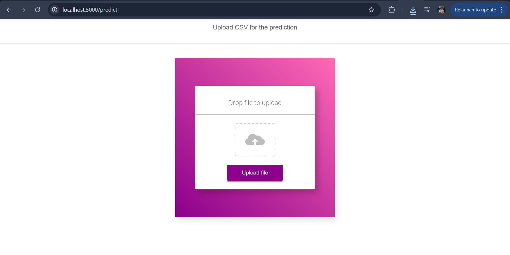
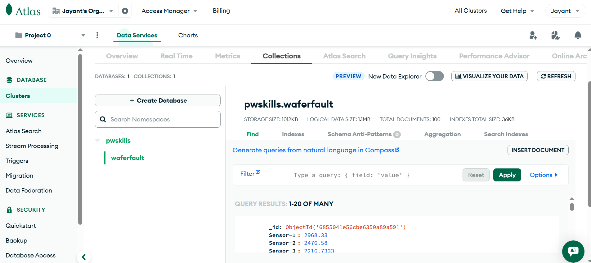

# Sensor Fault Detection System 🚨

An end-to-end Machine Learning project that detects faulty sensor readings from input data using Scikit-learn. The system features a Flask-based web interface and stores incoming data in MongoDB.

---

## 🔧 Tools & Technologies

- Python  
- Scikit-learn  
- Flask (Web Framework)  
- MongoDB (Database)  
- HTML/CSS (Frontend)  
- Git & GitHub  

---

## 🚀 Project Features

- Trains an ML model to detect faulty sensor data  
- Flask web interface for uploading data and receiving predictions  
- MongoDB integration for storing and retrieving input/output  
- Packaged with `setup.py` for modularity and reuse  
- Simple HTML/CSS frontend to interact with the backend  

---

## 📁 Project Structure


sensor_project/
├── static/ # CSS files
├── templates/ # HTML files
├── src/ # Source code (ML pipeline, model, etc.)
├── app.py # Flask main app
├── requirements.txt # Dependencies
├── setup.py # Python package config
└── README.md

## 🛠️ How to Run the Project Locally
```bash
git clone https://github.com/Jayant8140/Sensorprojuct01.git
cd Sensorprojuct01
pip install -r requirements.txt
python app.py
```


Then open http://localhost:5000 in your browser.

## 📸 Screenshots

### 🖥️ Web Interface


### 📂 MongoDB Data


✍️ Author
Jayant
📧 Email: jayantbca012@gmail.com
